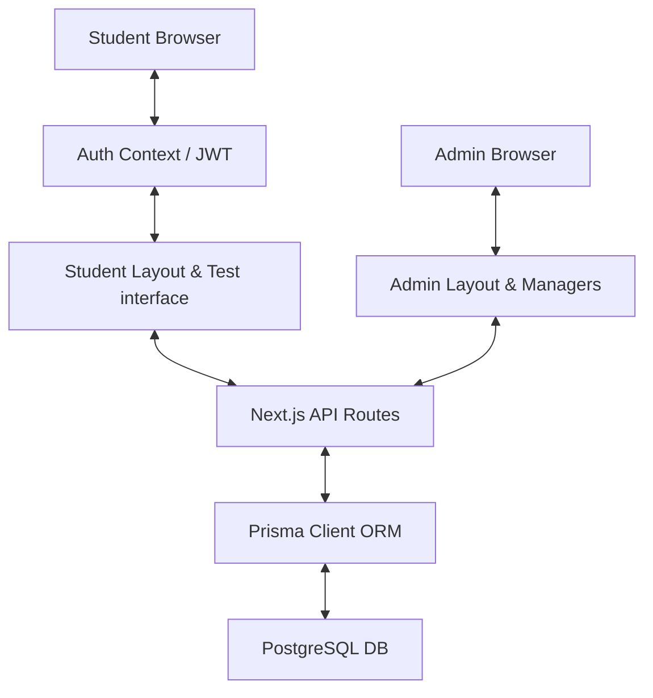

# System Architecture

The Aptitude Screening Portal is built as a unified Next.js 16 application leveraging PostgreSQL and the Prisma ORM for type-safe database access.

## Architecture Diagram



## Technology Stack

* **Frontend**: Next.js 16 (App Router), React 19, Tailwind CSS, React Hook Form
* **State Management**: React Context (`context/auth-context.tsx`)
* **API Handlers**: Next.js Serverless Routes
* **Authentication**: JSON Web Tokens (JWT) stored in LocalStorage, verified on every API request. Password hashing via `bcryptjs`.
* **Database Access**: Prisma ORM, utilizing PostgreSQL pool connections.
* **Input Validation**: Centralized Zod schemas (`lib/validators.ts`).

## Directory Structure

```text
screening-app/
├── app/                  # Next.js 16 Pages & API Router
│   ├── admin/            # Admin protected pages
│   ├── student/          # Student protected pages
│   ├── auth/             # Public Login/Register views
│   └── api/              # Backend serverless API routes
├── components/           # Reusable UI React components
│   ├── admin/            # Admin Managers (Evaluation, Questions)
│   ├── student/          # Student Profile & Dashboard
│   └── test/             # Test-taking interface
├── context/              # Authentication Global Context providers
├── lib/                  # Helper utilities (Prisma client, Auth wrappers, Zod validators)
├── docs/                 # Project documentation directory
├── prisma/               # Schema modeling and seed files
└── public/               # Static assets & files
```
