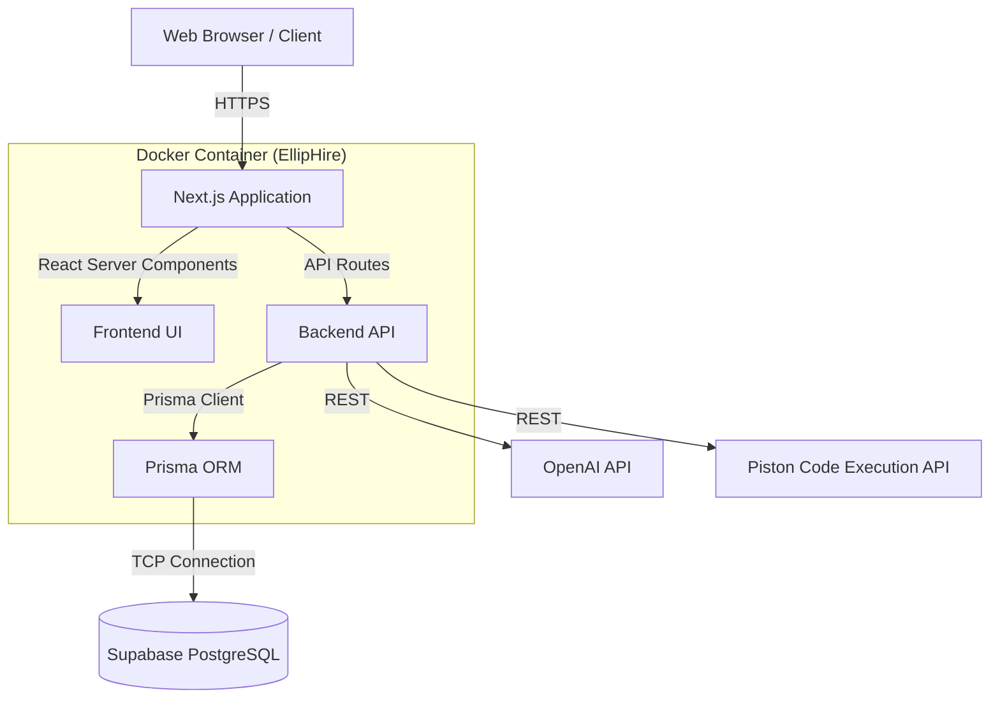
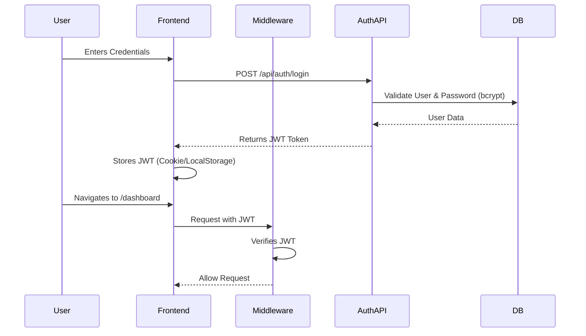

# EllipHire - Architecture Documentation

## High-Level Architecture
EllipHire follows a modern, decoupled Monolithic architecture leveraging Next.js (App Router) for both the Frontend UI and Backend API layers. This approach allows for rapid development, unified type safety (via TypeScript), and seamless server-side rendering.

```mermaid
graph TD
    Client[Web Browser / Client] -->|HTTPS| NextJS[Next.js Application]
    
    subgraph "Docker Container (EllipHire)"
        NextJS -->|React Server Components| UI[Frontend UI]
        NextJS -->|API Routes| API[Backend API]
        API -->|Prisma Client| ORM[Prisma ORM]
    end

    ORM -->|TCP Connection| DB[(Supabase PostgreSQL)]
    
    API -->|REST| OpenAI[OpenAI API]
    API -->|REST| Piston[Piston Code Execution API]
```

## Frontend Architecture
- **Framework**: Next.js 16 (App Router)
- **Styling**: Tailwind CSS for utility-first styling.
- **Component Library**: shadcn/ui for accessible, unstyled, customizable UI components.
- **State Management**: React Hooks (useState, useEffect, useContext) and Server Actions where appropriate.
- **Data Fetching**: Next.js Server Components for initial data load, standard `fetch` API / `axios` for client-side dynamic requests.

## Backend Architecture
- **API Layer**: Next.js Route Handlers (`app/api/*`).
- **Authentication**: Custom JWT-based authentication flow. Tokens are issued upon login and validated via Next.js Middleware (`middleware.ts`) before granting access to protected routes.
- **ORM**: Prisma provides type-safe database access.
- **File Handling**: Excel imports (`xlsx` library) are processed in memory within API routes before being bulk-inserted into the database.

## Database (Supabase PostgreSQL)
The database is fully decoupled from the application container.
- Hosted on Supabase (Serverless PostgreSQL).
- Interacted with strictly via Prisma ORM.
- **Connection**: Managed via connection pooling (`Pool` from `pg` and `@prisma/adapter-pg`) configured in `lib/prisma.ts`.

## AI Evaluation Architecture
When a student submits an assessment, evaluating subjective or technical questions follows an asynchronous or synchronous pipeline depending on configuration.

### Flow
1. **Submission**: User submits a test. The UI sends a payload containing question IDs and answers to `/api/tests/[id]/submit`.
2. **Routing**: The backend identifies AI-evaluable questions (`coding`, `structured_response`, `open_text`).
3. **Execution**:
   - **Coding**: Source code + Test Cases are sent to the **Piston API**. The response (stdout/stderr) is compared against expected outputs.
   - **Open Text**: The student's text, question prompt, and rubric are formatted into a prompt and sent to the **OpenAI API**.
4. **Scoring**: The AI (or Piston executor) returns a JSON object containing a `score`, `feedback`, `strengths`, and `improvements`.
5. **Persistence**: The evaluation result is stored in the `TestResponse` table under `ai_evaluation_json`, and the test's total score is recalculated.

## Docker Architecture
To simplify deployment, the entire Next.js application is containerized.
- **Base Image**: `node:22-alpine` (Small footprint, secure).
- **Multi-Stage Build**:
  - `deps`: Installs `npm` dependencies.
  - `builder`: Generates Prisma client and runs `npm run build`.
  - `runner`: Runs the application as a non-root user (`nextjs`).
- **Dependencies**: The Docker setup *does not* include a local PostgreSQL container by design, as the application relies on the external Supabase instance.

## Authentication Flow

```mermaid
sequenceDiagram
    participant User
    participant Frontend
    participant Middleware
    participant AuthAPI
    participant DB

    User->>Frontend: Enters Credentials
    Frontend->>AuthAPI: POST /api/auth/login
    AuthAPI->>DB: Validate User & Password (bcrypt)
    DB-->>AuthAPI: User Data
    AuthAPI-->>Frontend: Returns JWT Token
    Frontend->>Frontend: Stores JWT (Cookie/LocalStorage)
    
    User->>Frontend: Navigates to /dashboard
    Frontend->>Middleware: Request with JWT
    Middleware->>Middleware: Verifies JWT
    Middleware-->>Frontend: Allow Request
```
