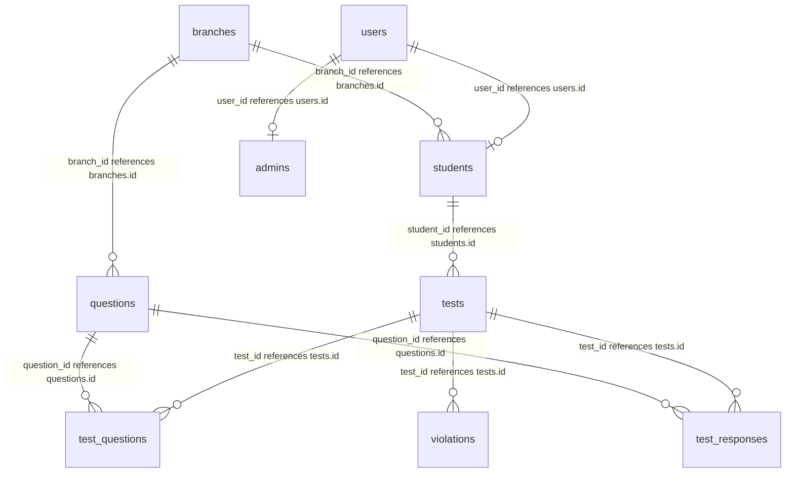

# Database Schema Documentation

The database schema is defined inside [schema.prisma](file:///c:/Users/R%20P%20Varada%20Rangan/Downloads/screening-app/prisma/schema.prisma). It maps to 10 PostgreSQL tables.

## Entity Relationship Diagram

## Schema Reference

### 1. `users` Table
Stores base credentials for authentication and RBAC.
* `id` (UUID, Primary Key)
* `email` (VARCHAR, Unique) - Candidate or administrator email.
* `password_hash` (VARCHAR) - Bcrypt hashed password.
* `role` (VARCHAR) - Roles: `student`, `admin`, `super_admin`.
* `created_at` / `updated_at` (TIMESTAMP)

### 2. `students` Table
Stores student candidate profiles.
* `id` (UUID, Primary Key)
* `user_id` (UUID, Foreign Key referencing `users.id`)
* `full_name` (VARCHAR)
* `phone` (VARCHAR)
* `college` (VARCHAR)
* `usn` (VARCHAR, Unique)
* `branch_id` (UUID, Foreign Key referencing `branches.id`)
* `profile_completed` (BOOLEAN, default: false)

### 3. `admins` Table
Stores profile information for administrative users.
* `id` (UUID, Primary Key)
* `user_id` (UUID, Foreign Key referencing `users.id`)
* `full_name` (VARCHAR)
* `department` (VARCHAR)

### 4. `branches` Table
College departments/branches (e.g. CSE, ECE).
* `id` (UUID, Primary Key)
* `name` (VARCHAR, Unique)

### 5. `questions` Table
Houses all aptitude questions.
* `id` (UUID, Primary Key)
* `question_text` (TEXT)
* `type` (VARCHAR) - `mcq`, `coding`, `essay`, `true_false`.
* `category` (VARCHAR) - e.g. Quantitative, Logical.
* `branch_id` (UUID, Foreign Key referencing `branches.id`)
* `options_json` (JSONB) - Option details.
* `correct_answer` (VARCHAR) - Index or exact correct choice.
* `explanation` (TEXT)
* `time_limit_seconds` (INT)
* `points` (INT) - Question Marks worth.
* `is_published` (BOOLEAN, default: false)

### 6. `tests` Table
Individual test sessions allocated to students.
* `id` (UUID, Primary Key)
* `student_id` (UUID, Foreign Key referencing `students.id`)
* `start_time` / `end_time` (TIMESTAMP)
* `status` (VARCHAR) - `not_started`, `in_progress`, `submitted`, `evaluated`.
* `total_duration` (INT) - Total test length in minutes.
* `current_duration` (INT) - Current time elapsed in seconds.
* `violations_count` (INT) - Amount of anti-cheat violations caught.
* `score` (DECIMAL) - MCQ score percentage.
* `results_published` (BOOLEAN, default: false) - Controls score visibility.

### 7. `test_questions` Table
Links questions to test instances (Many-to-Many).
* `id` (UUID, Primary Key)
* `test_id` (UUID, Foreign Key referencing `tests.id`)
* `question_id` (UUID, Foreign Key referencing `questions.id`)
* `sequence_number` (INT)

### 8. `test_responses` Table
Saves applicant answers (auto-saves and submissions).
* `id` (UUID, Primary Key)
* `test_id` (UUID, Foreign Key referencing `tests.id`)
* `question_id` (UUID, Foreign Key referencing `questions.id`)
* `student_answer` (TEXT)
* `is_correct` (BOOLEAN)
* `points_earned` (DECIMAL)
* `auto_saved_at` / `submitted_at` (TIMESTAMP)

### 9. `violations` Table
Logs student cheating activities during tests.
* `id` (UUID, Primary Key)
* `test_id` (UUID, Foreign Key referencing `tests.id`)
* `violation_type` (VARCHAR) - e.g. `suspicious_activity` for tab switching.
* `description` (TEXT)

### 10. `test_templates` / `test_analytics` Tables
Manages test presets and aggregates dashboard metrics.
