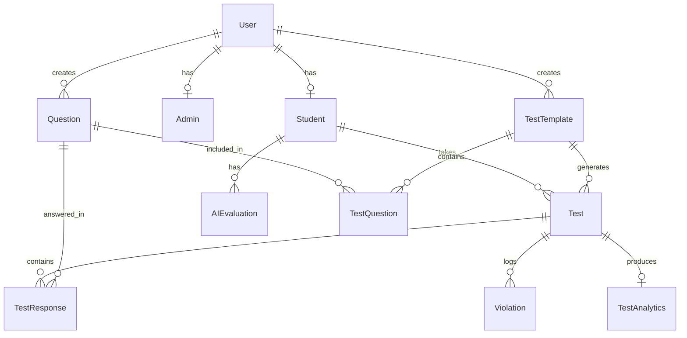

# EllipHire - Database Schema

The database for EllipHire is managed via Prisma ORM and hosted on PostgreSQL (Supabase). This document outlines the core entities, their fields, and relationships.

## Entity-Relationship Overview

```mermaid
erDiagram
    User ||--o| Student : has
    User ||--o| Admin : has
    User ||--o{ Question : creates
    User ||--o{ TestTemplate : creates

    Student ||--o{ Test : takes
    Student ||--o{ AIEvaluation : has
    
    TestTemplate ||--o{ Test : generates
    
    Test ||--o{ TestResponse : contains
    Test ||--o{ Violation : logs
    Test ||--o| TestAnalytics : produces
    
    Question ||--o{ TestQuestion : included_in
    TestTemplate ||--o{ TestQuestion : contains
    Question ||--o{ TestResponse : answered_in
```

## Tables

### 1. `users`
Core authentication and authorization entity.
- **`id`**: UUID (Primary Key)
- **`email`**: String (Unique)
- **`password_hash`**: String
- **`role`**: String (`student`, `admin`, `super_admin`)
- **`is_active`**: Boolean
- **`created_at`** / **`updated_at`**: Timestamp

### 2. `students`
Profile data for candidate users.
- **`id`**: UUID (Primary Key)
- **`user_id`**: UUID (Foreign Key to `users.id`, Unique)
- **`full_name`**: String
- **`phone`**: String
- **`college`**: String
- **`usn`**: String (Unique)
- **`branch_name`**: String
- **`profile_completed`**: Boolean
- **`camera_permission`** / **`microphone_permission`**: Boolean

### 3. `admins`
Profile data for administrative users.
- **`id`**: UUID (Primary Key)
- **`user_id`**: UUID (Foreign Key to `users.id`, Unique)
- **`full_name`**: String
- **`department`**: String

### 4. `questions`
The global question bank.
- **`id`**: UUID (Primary Key)
- **`question_text`**: String
- **`type`**: String (`mcq`, `coding`, `open_text`, `structured_response`)
- **`difficulty`**: String (`easy`, `medium`, `hard`)
- **`branch`**: String
- **`options_json`**: JSONB (Stores MCQ options)
- **`correct_answer`**: String
- **`explanation`**: String
- **`time_limit_seconds`**: Int
- **`points`**: Int
- **`created_by`**: UUID (Foreign Key to `users.id`)

### 5. `test_templates`
Definitions for assessments (rounds).
- **`id`**: UUID (Primary Key)
- **`name`**: String
- **`description`**: String
- **`total_questions`**: Int
- **`total_duration`**: Int (Seconds)
- **`branch`**: String
- **`is_active`**: Boolean
- **`created_by`**: UUID (Foreign Key to `users.id`)

### 6. `test_questions`
Mapping table between TestTemplates and Questions.
- **`id`**: UUID (Primary Key)
- **`template_id`**: UUID (Foreign Key to `test_templates.id`)
- **`question_id`**: UUID (Foreign Key to `questions.id`)

### 7. `tests`
Individual student attempt instances.
- **`id`**: UUID (Primary Key)
- **`student_id`**: UUID (Foreign Key to `students.id`)
- **`template_id`**: UUID (Foreign Key to `test_templates.id`, Nullable)
- **`start_time`** / **`end_time`**: Timestamp
- **`status`**: String (`not_started`, `in_progress`, `submitted`, `evaluated`)
- **`total_duration`**: Int
- **`current_duration`**: Int
- **`score`**: Int

### 8. `test_responses`
Answers submitted for individual questions during a test.
- **`id`**: UUID (Primary Key)
- **`test_id`**: UUID (Foreign Key to `tests.id`)
- **`question_id`**: UUID (Foreign Key to `questions.id`)
- **`student_answer`**: String
- **`is_correct`**: Boolean
- **`points_earned`**: Int
- **`ai_evaluation_json`**: JSONB (Stores detailed rubric scores, feedback, strengths, and AI execution status)

### 9. `violations`
Logs of proctoring events during a test.
- **`id`**: UUID (Primary Key)
- **`test_id`**: UUID (Foreign Key to `tests.id`)
- **`violation_type`**: String (`tab_switch`, `window_blur`, etc.)
- **`severity`**: String (`warning`, `critical`)
- **`timestamp`**: Timestamp

### 10. `test_analytics`
Aggregated data for completed tests.
- **`id`**: UUID (Primary Key)
- **`test_id`**: UUID (Foreign Key to `tests.id`, Unique)
- **`total_questions`**: Int
- **`correct_answers`** / **`incorrect_answers`** / **`unanswered`**: Int
- **`total_score`**: Int
- **`time_taken`**: Int
- **`violations_count`**: Int
- **`percentile`**: Float

### 11. `branches`
Reference table for college branches/departments.
- **`id`**: UUID (Primary Key)
- **`name`**: String (Unique)
