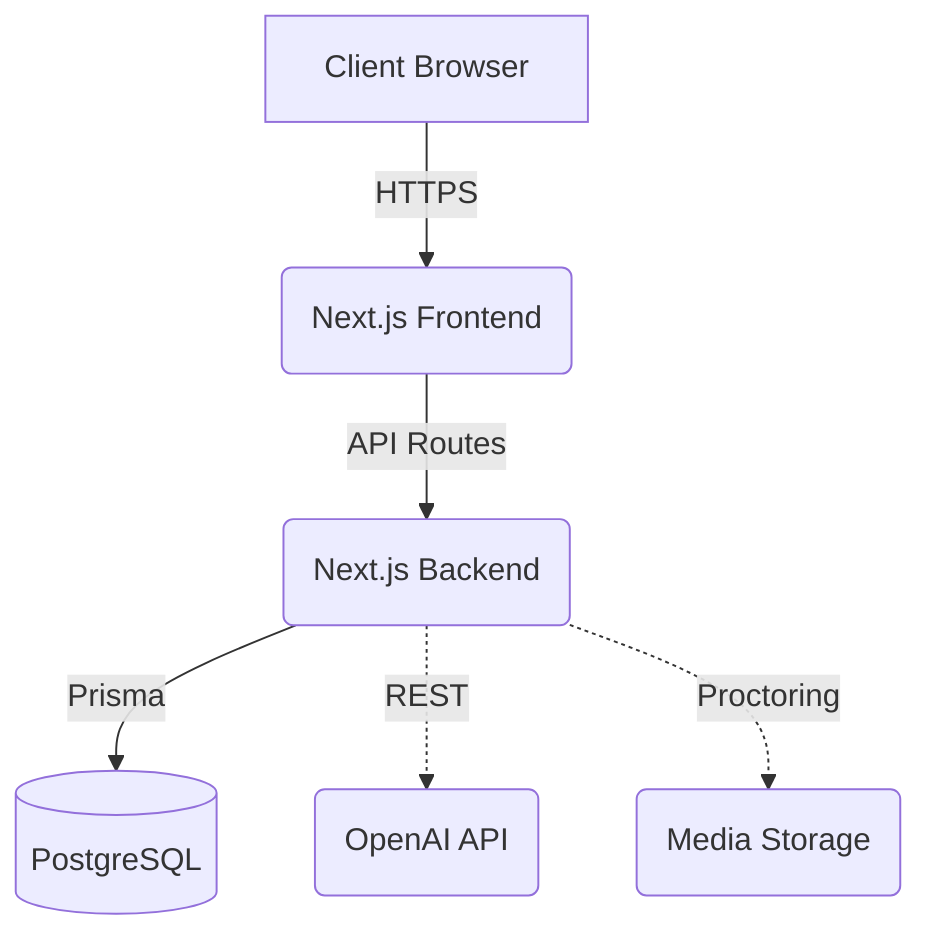
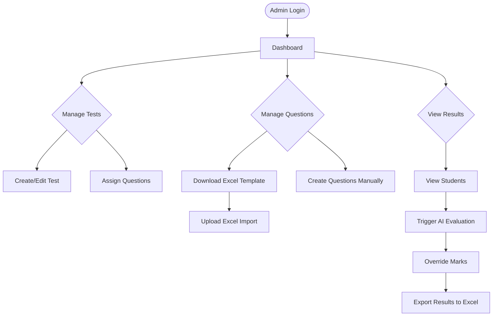
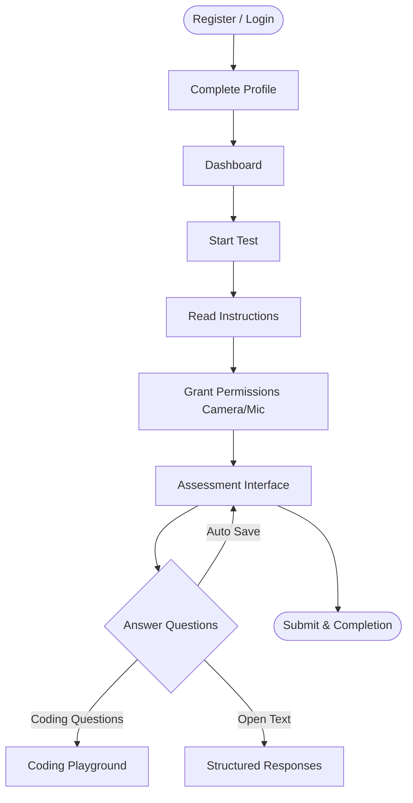

<div align="center">
  <h1>Workflow & System Documentation</h1>
  <p><strong>Smart Assessment & Recruitment Platform</strong></p>
</div>

---

## 1. 🏢 System Overview
EllipHire is a comprehensive platform engineered to automate and enhance the technical recruitment pipeline. It offers specialized tools for creating tests, monitoring candidates in real-time, and utilizing Artificial Intelligence to evaluate complex coding and open-text responses automatically.

## 2. 🏗️ High Level Architecture



## 3. 👥 User Roles

| Role | Description | Capabilities |
| :--- | :--- | :--- |
| **Super Admin** | System owner / HR Manager | Full access to create tests, manage questions, view proctoring logs, and override marks. |
| **Student** | Candidate | Can take assigned tests, view instructions, and submit responses in a proctored environment. |

## 4. 👨‍💼 Admin Workflow



### Key Admin Actions:
- **Login:** Secure entry via credentials.
- **Dashboard:** High-level metrics on tests and candidates.
- **Create Questions:** Manual entry or bulk upload.
- **Download Templates / Upload Excel:** Standardized data entry.
- **Manage Tests:** Configuring time limits, active status, etc.
- **View Students:** Checking progress and proctoring status.
- **AI Evaluation:** Running automated scripts for scoring.
- **Override Marks:** Manual intervention for edge cases.
- **Export Results:** Downloading data for HR systems.

## 5. 🎓 Student Workflow



### Key Student Actions:
- **Permissions:** Mandatory camera, microphone, and full-screen access to prevent tab switching.
- **Assessment:** Engaging with different question types.
- **Auto Save:** Background state saving to prevent data loss.

## 6. 🤖 AI Evaluation Workflow
1. Test submitted by the candidate.
2. System identifies Coding and Open Text questions.
3. Relevant context (Prompt, Student Code/Text, Expected Output) is packaged.
4. Payload sent to AI Evaluation Module via secure API.
5. AI returns a structured score and detailed feedback.
6. Database is updated with the AI results seamlessly.

## 7. 📊 Excel Import Workflow
1. Admin downloads the `EllipHire_Question_Template.xlsx` from the dashboard.
2. Admin fills in rows (Type, Prompt, Options, Correct Answer, Score).
3. Admin uploads the completed file.
4. Server parses the file, validates the data, and bulk-inserts into the database.

## 8. 📈 Result Processing Workflow
Results are aggregated continuously. Once a test ends (or time expires), final scores are tabulated by combining objective (Multiple Choice) scores and subjective (AI-evaluated) scores. The system generates a comprehensive result breakdown.

## 9. 📤 Export Workflow
Admins can select a specific test and click "Export". The system queries all relevant student responses and scores, converts the JSON payload to an XLSX format, and serves it as a downloadable blob directly to the admin's browser.

## 10. 🗄️ Database Flow
The database uses normalized tables. Key entities include:
- `User` (Admin/Student)
- `Test` (Assessment configuration)
- `Question` (Linked to tests or bank)
- `Response` (Student's answer)
- `Result` (Aggregated final score)

## 11. 🔌 API Flow
- **`/api/auth/*`**: Handles JWT issuance and validation via NextAuth.
- **`/api/tests/*`**: CRUD operations for managing assessments.
- **`/api/questions/*`**: Endpoints for question banks and Excel uploads.
- **`/api/evaluation/*`**: Webhooks/Endpoints for triggering AI processing.

## 12. 📁 Folder Structure

```text
screening-app/
├── app/               # Next.js App Router (Pages, Layouts)
│   ├── api/           # Backend API Routes
│   ├── admin/         # Admin Dashboard Pages
│   └── student/       # Candidate Assessment Pages
├── components/        # Reusable React UI Components
├── lib/               # Utility functions, AI logic, DB Client
├── prisma/            # Database Schema and Migrations
├── public/            # Static assets (Images, Icons)
└── docs/              # System Documentation (You are here)
```

## 13. 🧩 Module Explanation
- **Proctoring Module:** Hooks into the browser's MediaDevices API to capture periodic snapshots and monitor `visibilitychange` events for tab switching.
- **Code Execution Module:** Safely evaluates submitted code via an isolated environment or AI logic depending on the test configuration.
- **Auth Module:** Manages session state and role-based route protection securely.

## 14. 💻 Technology Stack
- **Core:** Next.js 14, React 18
- **Language:** TypeScript
- **Styling:** Tailwind CSS, Radix UI
- **Database:** PostgreSQL with Prisma ORM
- **Authentication:** NextAuth.js / Custom JWT
- **AI Processing:** OpenAI Models

## 15. 🚀 Future Scope
- **Live Interview Mode:** Enabling real-time video and collaborative code editing between admin and candidate.
- **Advanced Analytics:** Heatmaps of candidate time spent per question and behavioral indicators.
- **Behavioral Analysis:** Using AI to analyze proctoring video for attention, emotional state, and confidence tracking.

---
<div align="center">
  <br/>
  <p><em>EllipHire Platform Documentation - Confidential</em></p>
</div>
