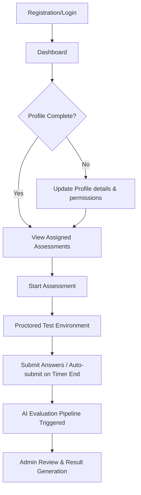
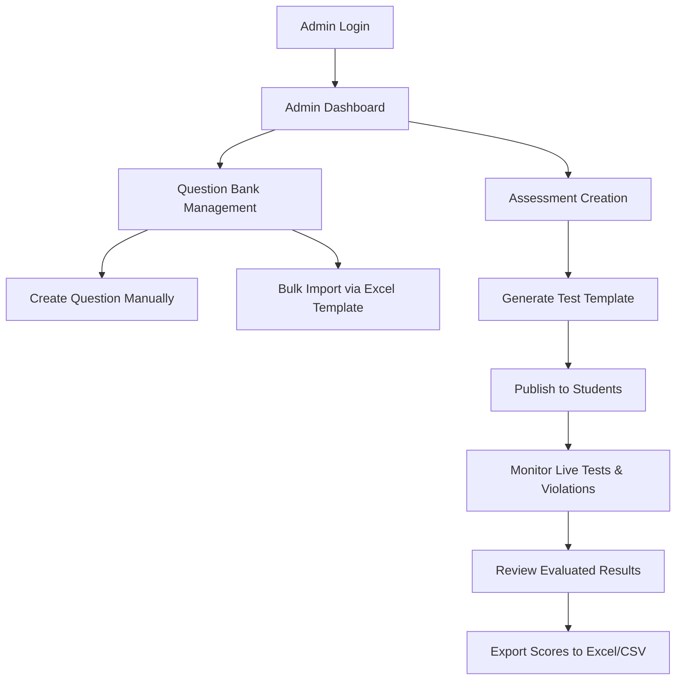
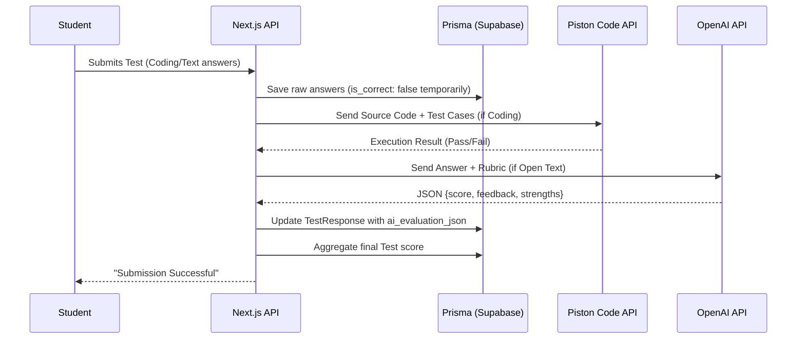

# EllipHire - Workflow and System Documentation

This document outlines the high-level workflows that govern how users interact with EllipHire and how the underlying systems process those interactions.

## 1. Student Workflow

The student journey is designed to be seamless, secure, and focused on taking assigned assessments.

- **Proctoring**: During the test, EllipHire logs events like window blurring, tab switching, and missing camera feeds. These are stored in the `violations` table for Admin review.

## 2. Admin Workflow

The Admin journey revolves around managing question banks, orchestrating assessments, and reviewing AI-generated results.

- **Question Bank Management**: Admins have full CRUD operations over MCQs, Coding, and Text questions. The Excel import flow automatically handles duplicates by cross-referencing identical question texts in the `questions` table.

## 3. AI Evaluation Workflow

The evaluation pipeline is the core intelligence of EllipHire. It processes submissions synchronously or asynchronously based on load and configuration.

- **Worker Processes**: For high scalability, evaluations can be offloaded to a background worker (`worker.ts`) using a Redis queue (BullMQ), though standard deployments process them via standard Next.js route handlers.

## 4. Docker Architecture Workflow

For production environments, EllipHire is containerized.

- **Build Phase**: The `Dockerfile` compiles Next.js into a standalone/production bundle and generates the Prisma Client against the Alpine linux architecture.
- **Run Phase**: `docker-compose up` runs the `elliphire-app` container exposing port 3000. It reads the `.env` file from the host.
- **Supabase**: The container does not host a database. It simply connects to the external Supabase instance over TCP/SSL using connection strings defined in the injected environment variables.
